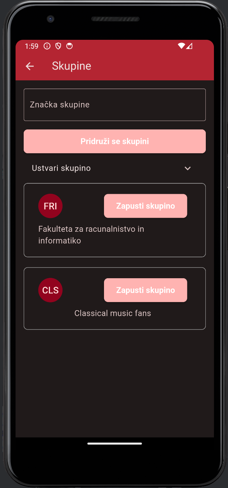

# Kam?  (Where to?) - [Slovenian README](README_SLO.md)
The **Kam?** application is a platform that combines the functionalities of event discovery, a social network, and a ticket sales system.  
It integrates features offered by Entrio (a ticket sales platform) and Facebook (a social network for connecting people), providing users with a more interactive and connected way of finding and attending events.  

  
    

  

## Technologies  
- Dart  
- Flutter  
- Firebase  

## Key Features:  
1. **Event Discovery and Overview**  
   - Users can easily search for events by name or see which events their friends have purchased tickets for.  
   - Events are displayed in a clear format with details such as event description, organizer, date and time, and direct ticket purchasing options.  

2. **Connecting with Friends and Other Participants**  
   - The application allows users to connect with friends, meaning they can easily track which events their friends are attending.  
   - Users can see which friends have already attended past events, fostering stronger social connections within the community.  
   - Connecting users with similar interests (joining specific groups) enables better user engagement.  

3. **Saving Events and Ticket Purchasing**  
   - Users can save events to their favorites list for easier access when they decide to purchase tickets.  
   - The app enables direct ticket purchases through an integrated system similar to Entrio, simplifying the entire reservation and purchase process.  

4. **Event Organization**  
   - Administrators can easily add events, including details such as the date, description, images, and ticket sales options.  

## Application Advantages:  
- **Ease of Use:** The combination of functionalities typically found in multiple applications (e.g., event discovery, connecting with participants, and ticket purchasing) allows users to access all the necessary information in one place.  
- **Social Connectivity:** The social aspect enhances user interaction by enabling them to follow their friends' activities and receive recommendations for events.  
- **Service Integration:** Integrating various functionalities (social networking, ticket sales, and event discovery) allows users to seamlessly switch between tasks without needing multiple applications.  

## Target Audience:  
The **Kam?** application is designed for a broad range of users who want to:  
- Easily discover and track events in their area.  
- Gain insight into their friends’ activities and attend events with them.  
- Conveniently purchase tickets and organize their own events.  
- Find communities and individuals with similar interests attending the same events.  

Through this project, we aim to create a platform that connects people through shared experiences, provides easy access to events, and enhances the user experience in discovering, attending, and organizing events.  

## Possible Improvements  
- Under the "Friends" tab, display only events that have not yet occurred.  
- Under the "Tickets" tab, display only tickets for upcoming events.  
- Create a new "History" tab to display events/tickets for past events.  
- Enable searching by various criteria, such as date, location, type of event (concerts, sports, cultural events, etc.), popularity, and recommendations.  
- Introduce a special role for organizers:  
  - Each organizer can easily add an event, including details such as date, location, description, images, and ticket sales options.  
  - Event organizers can track ticket sales and attendee interest.  

## Usage Information  
**Admin Account:**  
Email: admin@kam.com  
Password: admin123  

**User Accounts:**  
Log in to each account using the email: `name@kam.com` and the password: `name123`.  
Example users:  
- marija  
- maja  
- marko  
- franc  

**Notes:**  
- Google account sign-up is disabled for security reasons.  
- The following functionalities are not yet operational: sharing, inviting, and PDF downloads.  

# Images  

  
    
    
    
    
    
    
    
    
    
    
    

  
