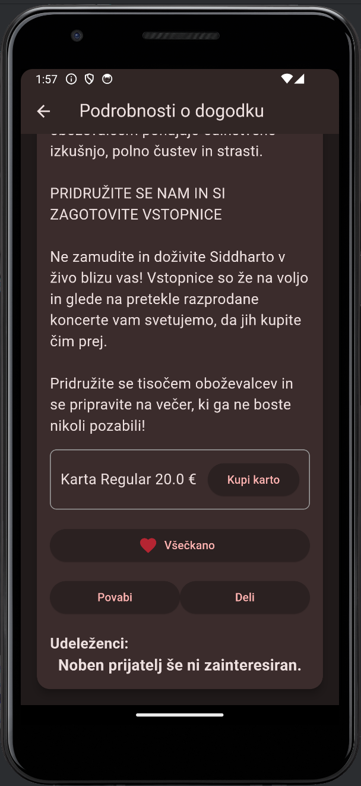
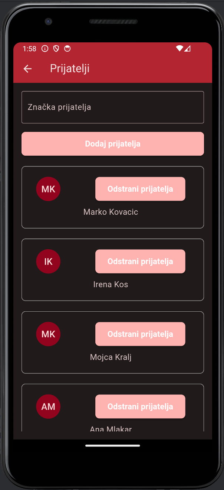

# Kam?
Aplikacija Kam? je platforma, ki združuje funkcionalnosti iskanja dogodkov, družbenega omrežja in sistema za prodajo vstopnic. 
Gre za kombinacijo funkcij, ki jih ponujata Entrio (platforma za prodajo vstopnic) in Facebook (socialno omrežje za povezovanje ljudi), kar omogoča uporabnikom bolj interaktiven in povezan način iskanja ter udeleževanja dogodkov.

  

## Tehnologije
- Dart
- Flutter
- Firebase

## Ključne funkcionalnosti:
1. Iskanje in pregled dogodkov
- Uporabniki lahko enostavno iščejo dogodke po imenih, lahko pa tudi vidijo za katere dogodke so kupili karte njihovi prijatelji.
- Dogodki so prikazani v preglednem formatu, s podrobnostmi, kot so opis dogodka, organizator, datum in ura, direktna možnost nakupa vstopnic.
2. Povezovanje s prijatelji in drugimi udeleženci
- Aplikacija omogoča povezovanje z prijatelji, kar pomeni, da lahko uporabniki enostavno spremljajo, katerih dogodkov se bodo udeležili njihovi prijatelji.
- Uporabniki lahko vidijo, kateri prijatelji so se že udeležili preteklih dogodkov, kar omogoča večje socialno povezovanje znotraj skupnosti.
- Povezovanje uporabnikov z enakimi interesi (pridružitev določeni skupini) omogoča boljšo
povezanost uporabnikov.
3. Shranjevanje dogodkov in nakup vstopnic
- Dogodke lahko uporabniki shranijo v svoj seznam priljubljenih, kar jim omogoča lažji dostop do dogodkov, ki jih želijo obiskati, ko se odločijo za nakup vstopnic.
- Aplikacija omogoča neposreden nakup vstopnic preko integriranega sistema, podobno kot pri Entrio, s čimer se poenostavi celoten postopek rezervacije in nakupa.
4. Organizacija dogodkov
- Administrator lahko enostavno doda dogodek, vključno z informacijami o datumu, opisu, slikah in možnostjo prodaje vstopnic.

## Prednosti aplikacije:
- Enostavna uporaba: Kombinacija funkcij, ki jih običajno najdemo v več različnih aplikacijah (npr. iskanje dogodkov, povezovanje z ostalimi udeleženci in nakup vstopnic), omogoča uporabnikom, da vse potrebne informacije najdejo na enem mestu.
- Povezovanje s prijatelji: Socialni vidik omogoča boljšo interakcijo med uporabniki, saj lahko spremljajo dejavnosti svojih prijateljev in prejemajo priporočila za dogodke.
- Integracija storitev: Povezovanje različnih funkcionalnosti (družabno omrežje, prodaja vstopnic, iskanje dogodkov) omogoča, da uporabniki enostavno prehajajo med različnimi nalogami, ne da bi morali preklapljati med več aplikacijami.

## Ciljna publika:
Aplikacija Kam? je namenjena širokemu krogu uporabnikov, ki želijo:
- Enostavno iskati in spremljati dogodke v svoji okolici.
- Imati vpogled v dejavnosti svojih prijateljev in se udeleževati dogodkov skupaj z njimi.
- Enostavno kupovati vstopnice in organizirati lastne dogodke.
- Poiskati skupnosti in posameznike s podobnimi interesi, ki se udeležujejo istih dogodkov.

S tem projektom želimo ustvariti platformo, ki povezuje ljudi skozi skupne izkušnje, omogoča enostaven dostop do dogodkov ter izboljša uporabniško izkušnjo pri iskanju, udeležbi in organizaciji dogodkov.

## Možne izboljšave
- pod zavihkom "Prijatelji" prikaži samo dogodke, ki se še niso zgodili
- pod zavihkom "Karte" prikaži samo karte za dogodke, ki se še niso zgodili
- ustvari nov zavihek "Zgodovina", kjer so prikazani dogodki/karte, za dogodke, ki so že minili
- iskanje po različnih kriterijih, kot so datum, lokacija, vrsta dogodka (koncerti, športni dogodki, kulturne prireditve ipd.), priljubljenost ter priporočila.
- posebna vloga za organizatorja
  - Vsak organizator enostavno doda dogodek, vključno z informacijami o datumu, lokaciji, opisu, slikah in možnostjo prodaje vstopnic.
  - Organizator dogodkov enostavno spremlja prodajo vstopnic ter interes udeležencev.

## Podatki za uporabo
Admin račun:  
email: admin@kam.com  
geslo: admin123  

Uporabniški računi:  
V vsak račun se prijavimo z email: ime@kam.com in geslom: ime123  
Nekaj uporabnikov:  
marija  
maja  
marko  
franc  

Signup z google računom je onemogočeno zaradi varnosti.   
Prav tako funkcijonalnosti deli, povabi, prenos pdf še ne delujejo.  

# Slike

  
  
  
  
  
  
  
  
  
  
  

